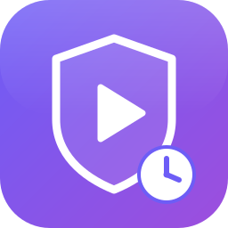

<p align="center">
  
</p>

# Media Time Guard

[](https://github.com/hacs/integration)

> Tägliche Medien-/Hörzeit pro Person robust und manipulationssicher begrenzen –
> primär für Sonos One, generell für **jede** `media_player`-Entität.
>
> *Daily, tamper-resistant media-time limits per person — primarily for Sonos One,
> but works with **any** `media_player` entity.* (English summary at the bottom.)

---

## 🇩🇪 Deutsch

**Media Time Guard** ist eine vollständig UI-konfigurierbare Home-Assistant-Integration,
die die tägliche Medienzeit einer Person auf zugeordneten Media-Playern begrenzt und die
Grenze auch dann durchsetzt, wenn Kinder aktiv versuchen, sie zu umgehen.

### Funktionen

- **Pro Person** beliebig viele Media-Player (ein Player gehört immer nur **einer** Person).
- **Pro Wochentag** ein eigenes Zeitbudget in Minuten (`0` = an dem Tag gesperrt).
- **Manipulationssichere Durchsetzung**: bei aufgebrauchtem Budget werden alle Player gestoppt;
  Wiedereinschalten/Neustart der Box hebt die Sperre **nicht** auf.
- **Wand-Uhr-Zählung**: gezählt wird nur der Zustand `playing`, gleichzeitiges Abspielen auf
  mehreren Boxen wird **nicht** doppelt gezählt.
- **Persistenz über Neustarts** (verbrauchte Zeit, Sperre, Extra-Minuten, Datum).
- **Warnung** kurz vor Ablauf – wahlweise per **TTS-Ansage** (mit Restzeit-Platzhalter) oder
  **Medien-URL**.
- **Extra-Minuten** per Service, Number-Entität oder Dashboard-Buttons (+15/+30).
- **Kontrolle aussetzen** (z. B. Kind ist krank) per Schalter oder Service.
- Übersetzt in **Deutsch, Englisch, Spanisch, Norwegisch (Bokmål), Griechisch, Japanisch,
  Französisch**.

### Installation (HACS)

1. HACS → ⋮ → *Benutzerdefinierte Repositories* → dieses Repo als Kategorie **Integration** hinzufügen.
2. *Media Time Guard* in HACS suchen und herunterladen.
3. Home Assistant neu starten.
4. *Einstellungen → Geräte & Dienste → Integration hinzufügen → „Media Time Guard“*.

> **Manuell:** Ordner `custom_components/media_time_guard/` nach `<config>/custom_components/`
> kopieren und HA neu starten.

### Einrichtung (eine Integration pro Person)

Der Konfigurationsassistent führt durch vier Schritte:

1. **Person & Player** – Name (z. B. `Luke`), optional eine `person`-Entität und die
   zugeordneten Media-Player. *Kinder ohne eigene `person`-Entität: einfach den Namen eintippen.*
2. **Tagesbudgets** – Minuten je Wochentag Montag–Sonntag (`0` = gesperrt).
3. **Warnung** – aktiv ja/nein, Restzeit-Schwelle, Methode (TTS **oder** Medien-URL), Ansagetext
   bzw. Content-ID.
4. **Reset** – Uhrzeit des Tages-Resets (Standard `00:00`).

Alle Werte lassen sich später über *Konfigurieren* (Options-Flow) ändern.

### Erzeugte Entitäten (pro Person)

| Entität | Zweck |
|---|---|
| `sensor.media_time_<person>_remaining` | verbleibende Minuten heute (Hauptvariable, viele Attribute) |
| `switch.media_time_<person>_suspend_today` | Kontrolle für heute aussetzen |
| `number.media_time_<person>_extend` | Extra-Minuten für heute (absoluter Wert) |
| `button.media_time_<person>_extend_15` / `_extend_30` | +15 / +30 Minuten |

**Sensor-Attribute:** `budget_minutes`, `used_minutes`, `remaining_minutes`,
`effective_budget_minutes`, `weekday`, `is_playing`, `is_locked`, `is_suspended`,
`extra_minutes_today`, `warned_today`, `last_reset`, `players`.

### Services

| Service | Beschreibung |
|---|---|
| `media_time_guard.extend_time` | `person`, `minutes` – Extra-Minuten hinzufügen |
| `media_time_guard.suspend_today` | `person`, `suspended` – Kontrolle aussetzen/aktivieren |
| `media_time_guard.reset_person` | `person` – Tageszählung manuell zurücksetzen |

`person` ist der konfigurierte Name (oder dessen Slug), Groß-/Kleinschreibung egal.

### Beispiel-Dashboard

```yaml
type: entities
title: Medienzeit Luke
entities:
  - entity: sensor.media_time_luke_remaining
    name: Restzeit heute
  - type: attribute
    entity: sensor.media_time_luke_remaining
    attribute: used_minutes
    name: Verbraucht
  - type: attribute
    entity: sensor.media_time_luke_remaining
    attribute: is_locked
    name: Gesperrt
  - entity: switch.media_time_luke_suspend_today
    name: Heute aussetzen
  - entity: number.media_time_luke_extend
    name: Extra-Minuten
  - entity: button.media_time_luke_extend_15
  - entity: button.media_time_luke_extend_30
```

### Standard-Entscheidungen (Defaults)

- **Ein Config-Entry = eine Person.** Mehrere Personen = mehrere Integrationseinträge. Die
  „ein Player nur einer Person“-Regel wird über **alle** Einträge hinweg validiert.
- **Personen ohne `person`-Entität** werden über den Namen identifiziert (Slug); die
  `person`-Bindung ist optional.
- **Reset-Standard** ist `00:00`. War HA über den Reset-Zeitpunkt hinweg aus, wird beim Start
  geprüft, ob das gespeicherte Medien-Datum noch dem aktuellen „Medientag“ entspricht.
- **`number.…_extend`** repräsentiert den **absoluten** Wert der Extra-Minuten heute; die
  Buttons und `extend_time` **addieren**.

### Bekannte Limitierung

Gezählt wird der State `playing`. **Stummgeschaltetes oder sehr leises Abspielen zählt
trotzdem**, da der Player-State weiterhin `playing` ist.

### Weiterführende Dokumentation

- Technische Dokumentation (EN): [`docs/TECHNICAL.md`](docs/TECHNICAL.md)
- Benutzerdokumentation: [`docs/user/`](docs/user) (de, en, es, fr, nb, el, ja)

---

## 🇬🇧 English (summary)

Media Time Guard limits the **daily media time** of a person across assigned `media_player`
entities and enforces the limit in a **tamper-resistant** way (children actively try to bypass
it). One config entry per person, per-weekday budgets in minutes (`0` = blocked), wall-clock
counting of the `playing` state only (no double counting across speakers), persistence across
restarts and power cycles, an optional one-time TTS/media warning, extra-minutes and a
suspend-today switch.

Install via HACS (custom repository, category *Integration*) or by copying
`custom_components/media_time_guard/` into your `<config>/custom_components/` folder, then add
the integration from *Settings → Devices & Services*. See [`docs/TECHNICAL.md`](docs/TECHNICAL.md)
for internals and [`docs/user/en.md`](docs/user/en.md) for the full user guide.

**Known limitation:** counting is based on the `playing` state, so muted/very quiet playback
still counts.

## License

MIT
